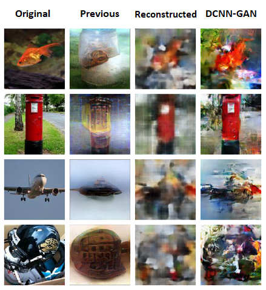

# DCNN-GAN: Reconstructing Realistic Image from fMRI

<table align="center" style="display:table;width:600px">
	<tbody><tr>
	    <td align="center" width="100px" style="border:none">
	  		

	  			<a href="https://github.com/CreeperLin">Yunfeng Lin</a>
		  	

		</td>
	  	<td align="center" width="100px" style="border:none">
	  		

	  			<a href="https://github.com/Aimalex">Jiangbei Li</a>
		    

		</td>
	  	<td align="center" width="100px" style="border:none">
	  		

	  			<a href="https://github.com/VegeWong">Hanjing Wang</a>
		  	

		</td>
</tr></tbody></table>
 
Shanghai Jiao Tong University
 
For MVA 2019
 
<table align="center" style="display:table;width:300px">
	<tbody><tr>
	  	<td align="center" width="50px" style="border:none">
	  		

	  		<a href="https://github.com/CreeperLin/DCNN-GAN/raw/master/docs/paper.pdf">[Paper]</a>
		  	

		</td>
	  	<td align="center" width="50px" style="border:none">
	  		

	  		<a href="https://github.com/CreeperLin/DCNN-GAN">[GitHub]</a>
		  	

		</td>
</tr></tbody></table>
 

## Abstract

Visualizing the perceptual content by analyzing human functional magnetic resonance imaging (fMRI) has been an active research area. However, due to its high dimensionality, complex dimensional structure, and small number of samples available, reconstructing realistic images from fMRI remains challenging. Recently with the development of convolutional neural network (CNN) and generative adversarial network (GAN), mapping multi-voxel fMRI data to complex, realistic images has been made possible. In this paper, we propose a model, **DCNN-GAN**, by combining a reconstruction network and GAN. We utilize the CNN for hierarchical feature extraction and the DCNN-GAN to reconstruct more realistic images. Extensive experiments have been conducted, showing that our method outperforms previous works, regarding reconstruction quality and computational cost.

## Authors

Yunfeng Lin, Jiangbei Li, Hanjing Wang

## Video Demo

<iframe width="800" height="450" src="https://www.youtube.com/embed/3wXBjfMs_D4" frameborder="0" allow="autoplay; encrypted-media" allowfullscreen></iframe>

<!-- 

 -->

## Code

Please refer to our github repository [here](https://github.com/CreeperLin/DCNN-GAN).

## Paper

Paper in PDF format is availale [here](https://github.com/CreeperLin/DCNN-GAN/raw/master/docs/paper.pdf) (~2MB).

Citation in bibtex availale [here](https://github.com/CreeperLin/DCNN-GAN/raw/master/docs/bibtex_paper.txt).

## Acknowledgements

The GAN model is based on the pytorch implementation of [pix2pix](https://github.com/junyanz/pytorch-CycleGAN-and-pix2pix).

The fMRI data is obtained using the datasets from [Generic Object Decoding](https://openneuro.org/datasets/ds001246/versions/1.0.1).